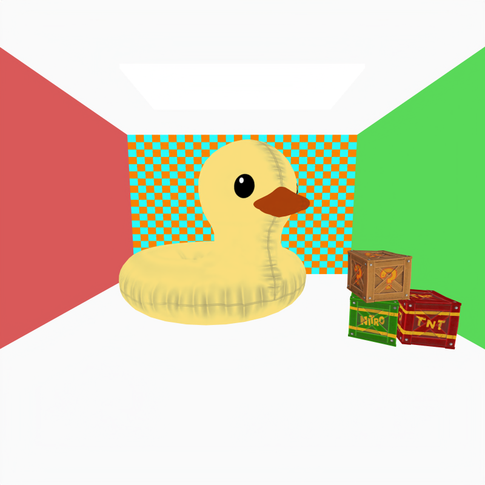
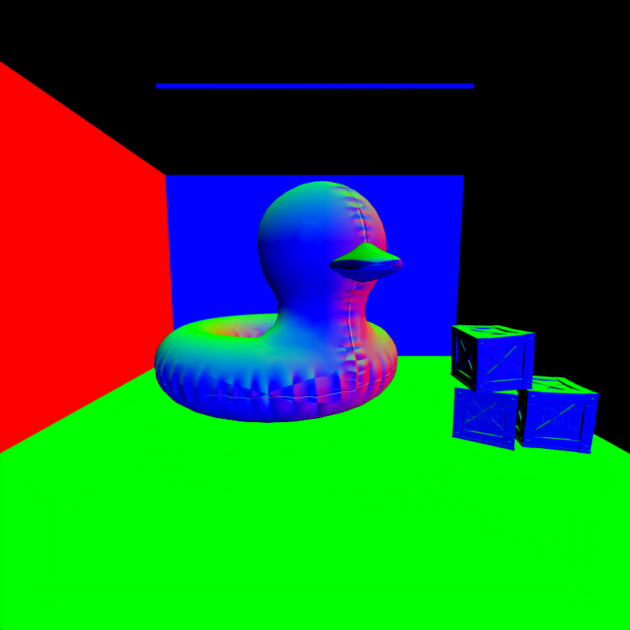
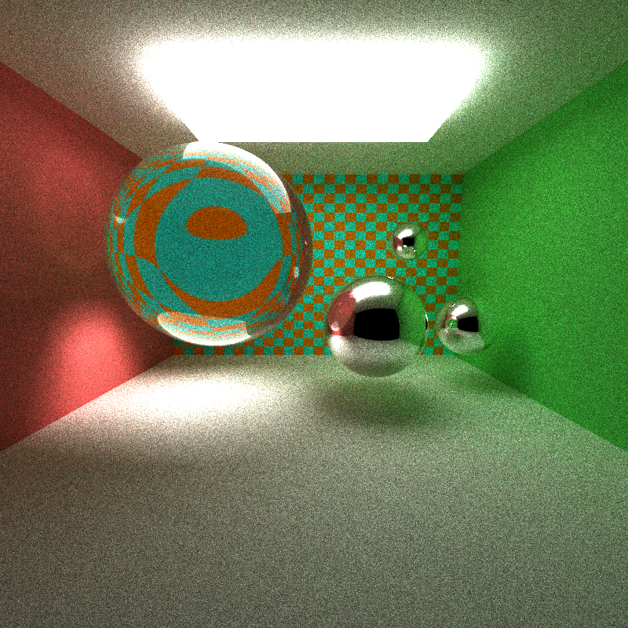
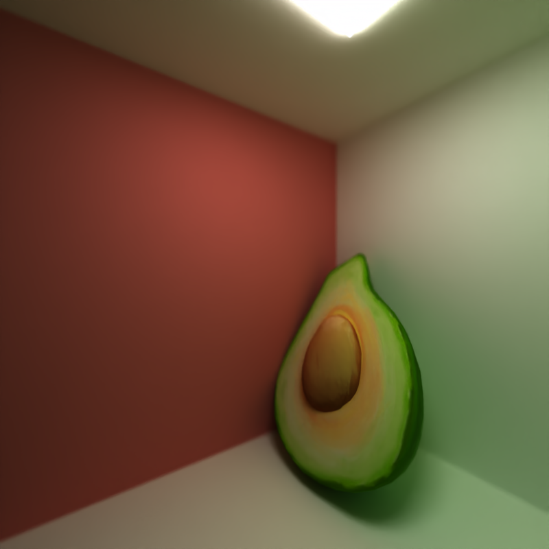
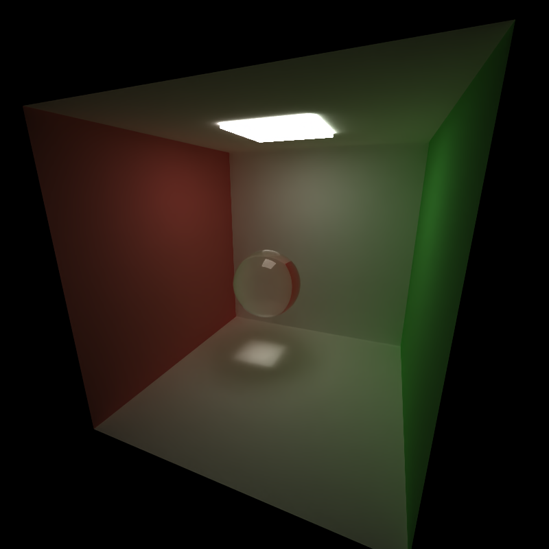
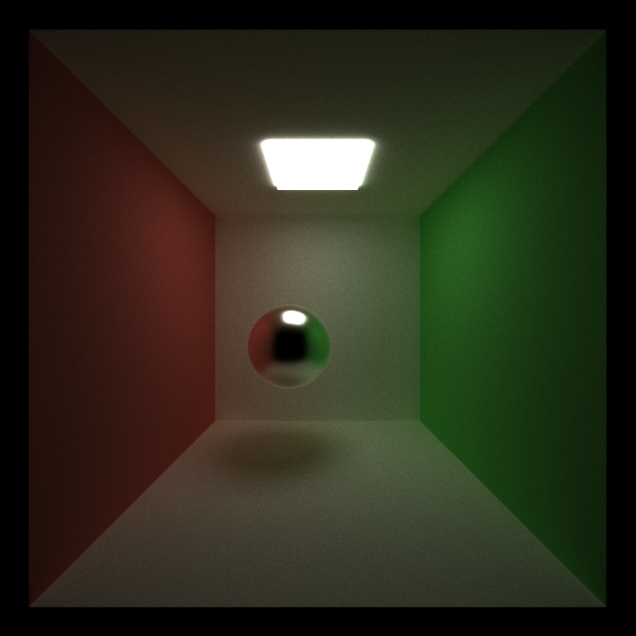
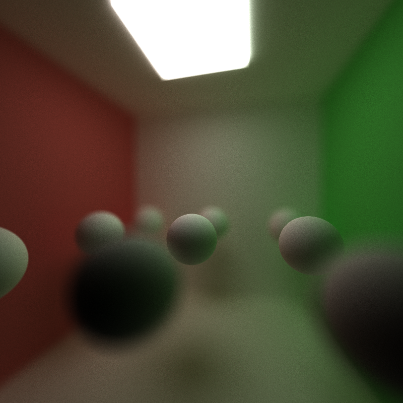
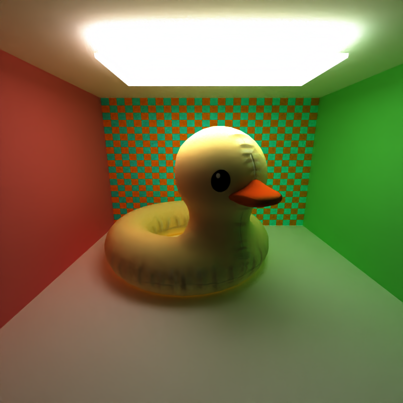
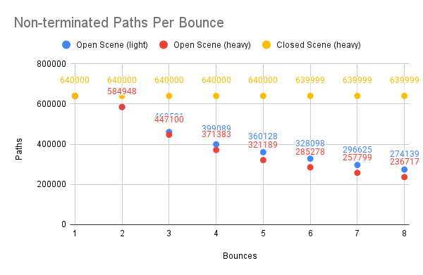
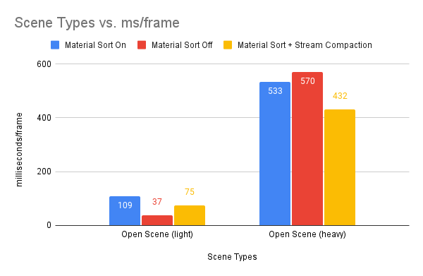

CUDA Path Tracer
================

## 🚀 Overview

> University of Pennsylvania, CIS 5650: GPU Programming and Architecture, Project 3 - CUDA Path Tracer
> * Michael Mason
>   + [Personal Website](https://www.michaelmason.xyz/)
> * Tested on: Windows 11, Ryzen 9 5900HS @ 3.00GHz 16GB, RTX 3080 (Laptop) 8192MB 

This is a Path Tracing Renderer (i.e. Arnold, RenderMan, V-Ray) written in C++ and CUDA which utilizes GPU hardware. This is an interactive renderer! It supports basic materials and scene handling, including glTF support, color & normal textures, and more! See below. 

### Supported Features

* glTF File Format
* Albedo Maps
* Normal Maps
* Depth of field
* Open Image Denoiser intergration
* Physically-Based Materials (BxDFs)
  * Matte (Perfect Diffuse BRDF)
  * Mirror (Perfect Specular BRDF)
  * Glass (Specular Reflection BRDF + Specular Transmission BTDF, mixed by fresnel)
  * Brushed Metal (Torrance-Sparrow Microfacet BRDF Model with a Trowbridge-Reitz Distribution)

## ✨ Feature Descriptions

### Scene Description and Loading 

Scenes in this renderer are described with a basic JSON schema that can specify cameras, materials and object primitives, including Spheres, Cubes and Triangle Meshes (using glTF). For more information about the JSON format, check `INSTRUCTIONS.md` and the scene examples in the scenes folder. 

#### glTF meshes

One node / one mesh glTF files can be loaded, so long as they contain the appropriate vertex attributes: positions, normals and texture coordinates (if textures are also included). 

The [glTF 2.0 specification](https://registry.khronos.org/glTF/specs/2.0/glTF-2.0.html) was referenced for this feature and was of great help!

<p align="center">

</p>

<p align="center">
<i>Duck Floatie & Crash Bandicoot Boxes</i>
</p>


#### Albedo and Normal Maps

With the glTF format, albedo and normal map textures are renderable and supported. 

Textures are implemented in CUDA using the `CUDA Texture Object API`. You can see how textures can be loaded into the GPU [here](https://github.com/micklemacklemore/CUDA-Path-Tracer/blob/main/src/pathtrace.cu#L126-L169), which can later be accessed by CUDA kernels [here](https://github.com/micklemacklemore/CUDA-Path-Tracer/blob/main/src/interactions.cu#L286-L296) (It's similar to `texture2D` when accessing a sampler in glsl). It's straighforward to use, however the documentation is sparse. I hope this might be another simple example on the internet to help another budding graphics student. 

<p align="center">


</p>

<p align="center">
<i>Albedo Pass, Surface Normal Pass</i>
</p>

### Intel Open Image Denoise

Intel Open Image Denoise is a high-performance open-source library for image noise filtering for ray-tracers. This library is integrated into the renderer and filters out the Monte Carlo sample noise that allows us to render smooth images faster. 

An image that would typically take 10,000 samples to render can be done in merely half the time, with potentially cleaner results. 

To denoise rendered images, the API is fairly straightforward. The denoiser accepts 32-bit floating point channels by default and you can see how it's used [here](https://github.com/micklemacklemore/CUDA-Path-Tracer/blob/main/src/pathtrace.cu#L625-L659). 

For information, go to the [OIDN homepage](https://www.openimagedenoise.org/).

<p align="center">


</p>

<p align="center">
<i>Before & After Denoising</i>
</p>

### Materials (BxDF's)

This renderer supports basic Bidirectional Scattering Distribution Function (BSDF) materials. At a high-level, BSDF's describe how light is scattered from certain materials. Using terminology from [Physically Based Rendering: From Theory to Implementation](https://pbr-book.org/3ed-2018/Reflection_Models) (commonly known as PBRT), BSDF's can generally be a combination of BRDF's (Reflectance Models, i.e. Diffuse and Specular) and BTDF's (Transmission Models, how light passes through translucent materials). The "Glass" Material below is an example of a BSDF (Specular Reflection BSDF + Transmission BTDF), and is based off of `FresnelSpecular` which is described by PBRT. 

#### Perfect Diffuse BRDF & Perfect Specular BRDF

<p align="center">


</p>

#### Glass (Specular Reflection BRDF + Specular Transmission BTDF, mixed by fresnel)

<p align="center">


</p>

<p align="center">
<i>Follow Freeman!</i>
</p>

#### Brushed Metal (Torrance-Sparrow Microfacet BRDF Model with a Trowbridge-Reitz Distribution)

> 🗨️ ***Comment:*** Seems to work okay with the implicit shapes, but when applied to meshes with normals, it seems to come with weird artifacts. As far as I know I pretty much ripped it straight out of `PBRTv3`, so I'm not sure where I went wrong!

<p align="center">

</p>

### Depth of Field

I found [this blog article](https://pathtracing.home.blog/depth-of-field/) which was used for reference and implementation. Producing depth of field (in layman's terms, ['bokeh' in a photograph](https://www.dropicts.com/how-to-achieve-stunning-bokeh-effect-in-your-photo/)) is done by picking a focal point along a generated ray, and jittering it's origin in the xy directions within an aperture. The focal point is the point along the ray where things will be in focus. Increasing the size of your aperture increases the "blur" effect. 

<p align="center">

</p>

## 📝 Performance Analysis

### ❔ Hypothesis

In this performance analysis we'll be testing two significant GPGPU optimizations made to the path tracer to boost performance: *Stream Compaction* and *Material Sorting*. It's beneficial to explain some of the code base to understand what these optimizations will do for us. 

```c++
// sceneStructs.h

struct PathSegment {
 Ray ray;         // origin + direction
 glm::vec3 color; // accumulated color
 int remainingBounces;
 bool isFinished;
 bool isTerminated;
}
```

In the code, the `PathSegment` class represents the path a ray takes at every bounce. Before the first bounce, there are `n == pixel count` number of path segments. 

The `PathSegment` has member attributes that determine whether or not it will continue after each bounce. `bool PathSegment::isFinished` is `true` when the path hit a light source and is ready to contribute to the final image. `bool PathSegment::isTerminated` is `true` when the path has either hit nothing or it never hit a light source. As opposed to *finished* paths, paths that are *terminated* are totally removed via ***Stream Compaction*** and no longer spawn kernels.

```c++
// sceneStructs.h

struct ShadeableIntersection {
 int materialID;  // index to material data
 // ...
}
```

Each `PathSegment` has an associated `ShadeableIntersection` which is created at each bounce (by the `computeIntersections` kernel) that contains information about the material at each hit-point of the ray path. 

Due to the one-to-one relationship between these two objects, they share the same index and thus both can (and must) be sorted in the same way. One can sort these objects by the material type for example.

Sorting by material would be beneficial as it would mean that kernels in the same warp would more likely execute similar code paths and access similar areas of memory when calculating light accumulation. 

This would mean *coherent memory access* and *reduced thread divergence*, and is what is attempted via ***Material Sorting***. 

These optimizations are explained in the next sections.

#### Stream Compaction

**Stream Compaction** involves terminating those ray paths at each bounce depth that will not contribute to the eventual final image. Specifically, these are paths that: 

* Ended up intersecting infinity (a.k.a. they did not intersect any object)
* Ended up not hitting a light source.

The first scenario will never occur in closed scenes, as eventually a ray will always hit geometry. And thus I suspect that stream compaction won't be as effective in closed scenes. We could further decrease it's effectiveness by adding an infinite light such as a "sky light" / "environment light".

#### Material Sorting

**Material Sorting** simply sorts both `PathSegments` and `ShadeableIntersections` by their material type. `ShadeableIntersections` store the material information and so it is used as a key in `thrust::sort_by_key`. If there is a considerable number of materials and a high number of non-terminated paths, this could have a considerable performance boost. 

### 🧪 Method

To test both optimizations fairly, four test scenes were created and are categorized based on two primary factors: the *geometry complexity* and the *environment type* (open vs. closed):


* Light Open Scene (Open Cornell Box with implicit spheres) 
* Heavy Open Scene (Open Cornell Box with 5k poly geometry) 

* Light Closed Scene (Closed Cornell Box implicit spheres)
* Heavy Closed Scene (Closed Cornell Box with 5k poly geometry)

With these scenes, the average application

> 📃 ***Note:*** I was fairly limited on what I could pick as a "heavy" scene. Using polygonal geometry beyond 10,000 triangles slows the renderer down to a point where any optimization changes appear negligable. This could have been helped by implementing an accelleration structure for polygon meshes such as BVH.   

<p align="center">
 

</p>

<p align="center">
<i>Light Open Scene (left) and Heavy Open Scene (right). Closed versions of these scenes are the same, but contain a fourth wall.</i>
</p>

### 📊 Results

#### Stream Compaction

Overall, it was found that stream compaction had a decent improvement across all scenes, and surprisingly this was also the case for closed scenes as well. 

The most signicant improvements were seen on the heavy scenes in particularly. For the Open Scene (heavy), there 30% decrease in framerate with stream compaction turned on. 

Somewhat unexpectedly, it also appears that the Closed Scene (heavy) experienced a ~11% decrease in framerate. The reason for this, is that even in closed scenes, there are still situations where the PathSegment may terminate early. This is explained and shown in the next section. 

The only scene that didn't experience a performance improvement is Closed Scene (light). It's likely that in this case, the overhead of sorting and removing terminated PathSegment exceeds the computation costs of a small scene that is likely not to have any of it's PathSegments terminated per bounce. 

> 📃 ***Note:*** Milliseconds/Frame represents the average time per frame for the first 120 frames that the application was running. This how ImGui outputs *per-frame* timing data by default. [See Here](https://github.com/ocornut/imgui/discussions/4138).

<p align="center">

</p>

<p align="center">
<i>Lower is Better.</i>
</p>

##### Has Advantages For Closed Scenes

To further understand why stream compaction might be advantageous for closed scenes, the number of unterminated PathSegments were compared for each bounce in a single iteration. In both Open Scene (light) and Open Scene (heavy) we can see a decrease in the number of unterminated PathSegments, and this is expected. 

However, Closed Scene (heavy) was added to illustrate that a very small number of PathSegments (in this case, only one) can be terminated in a closed scene. It was further investigated that on average, Closed Scenes may terminate 1-3 PathSegments per iteration. 

<p align="center">

</p>
<p align="center">
<i>Lower is Better.</i>
</p>

In `interactions.cu`, the `scatterRay` device function calculates the BRDF's for each Intersection.  

In some BRDF's, i.e perfectly diffuse, there are cases when the returned BRDF samples and PDF values are either miniscule or `NaN`. In these cases, the path is terminated entirely and the sample isn't considered. This avoids final colors in the final image that may be massively large or small (i.e. a [common result of this are fireflies](https://en.wikipedia.org/wiki/Fireflies_(computer_graphics))). 

```c++
if (pdf < EPSILON || isnan(pdf)) {
  pathSegment.isTerminated = true;
  return;
}
```

Even though this may happen only 1-3 times per iteration, I suppose those few early terminations accumulate over time and therefore the improvement in performance is significant. 

#### Material Sorting

It turns out that material sorting was a fairly insignificant optimization. In smaller scenes, it appears that the overhead of performing a sort for each bounce outweigh's the potential SIMT coherency benefits of sorted kernel calls. In the smaller Open Scene (light), Material Sorting increased framerates about 3 times versus having the optimization turned off. 

For heavier scenes, it does see some performance gain, however the the performance increase (about 7%) was quite small and may be a negligable difference. 

<p align="center">

</p>
<p align="center">
<i>Lower is Better.</i>
</p>

## References

"duck floaty" (https://skfb.ly/o8Mor) by raholder0909 is licensed under Creative Commons Attribution (http://creativecommons.org/licenses/by/4.0/).
"Teapot 2 (draft)" (https://skfb.ly/6VYIo) by MrsM is licensed under Creative Commons Attribution-NonCommercial (http://creativecommons.org/licenses/by-nc/4.0/).
"Crash Bandicoot Crates" (https://skfb.ly/otww6) by diabeticspoon92 is licensed under Creative Commons Attribution (http://creativecommons.org/licenses/by/4.0/).
"Gordon Freeman mosaic" (https://skfb.ly/oCE8R) by Evgeniy P is licensed under Creative Commons Attribution (http://creativecommons.org/licenses/by/4.0/).
