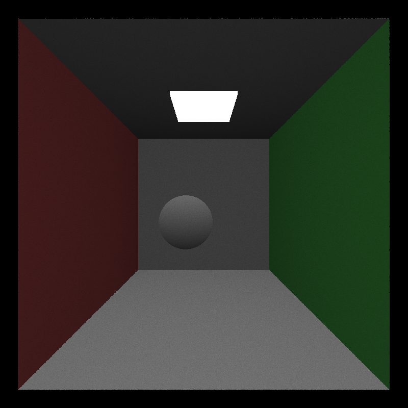
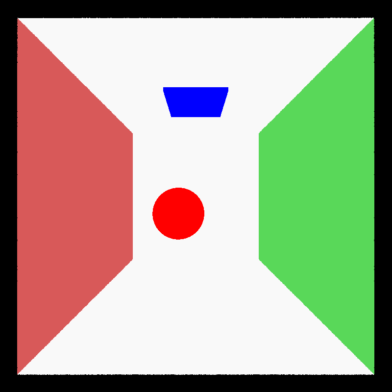

> Journal Entry - 2024-09-18

### *CUDA Path Tracer - Humble Beginnings*

Hello there, you've stumbled onto my first journal entry for the CUDA Path Tracer I'm building for `CIS 5650` at UPenn. So far all I've heard is that it's gonna be a doooooozy. So I'm starting early and making these journal entries, hoping that it'll help with my readme at the end. 

###### Wed Sep 18 21:25:52 EDT 2024

I found this super neat timestamp extension for VS Code, I'll be using this a lot, lol.

###### Wed Sep 18 21:26:45 EDT 2024

I also created this little powershell script to create my journal entries (courtesy of ChatGPT!) if anyone wants it I'll put it below!

```ps1
# Michael Mason's journal script. 

param (
    [switch]$edit  # Optional parameter to open the file in VS Code
)

# Define the journal directory and file name (without hours and minutes)
$journalDir = "./journal"
$journalFileName = "journal_$(Get-Date -Format 'yyyy-MM-dd').md"
$fullFilePath = Join-Path $journalDir $journalFileName

# Create the directory if it doesn't exist
if (-not (Test-Path -Path $journalDir)) {
    New-Item -Path $journalDir -ItemType Directory
}

# Define the image folder path based on the journal file name
$imgFolderPath = Join-Path $journalDir ("img/journal_$(Get-Date -Format 'yyyy-MM-dd')")

# Create the image folder path if it doesn't exist
if (-not (Test-Path -Path $imgFolderPath)) {
    New-Item -Path $imgFolderPath -ItemType Directory -Force
}

# Check if the file already exists
if (Test-Path -Path $fullFilePath) {
    Write-Host "Journal already exists."

    # If the -Edit switch is used, open the file in VS Code
    if ($Edit) {
        Start-Process code $fullFilePath
    }
} else {
    # Create the file with the current date and write the date as the heading
    New-Item -Path $fullFilePath -ItemType File -Force
    $dateHeading = "> Journal Entry - $(Get-Date -Format 'yyyy-MM-dd')"
    Add-Content -Path $fullFilePath -Value $dateHeading

    Write-Host "Journal created."

    # If the -Edit switch is used, open the file in VS Code
    if ($edit) {
        Start-Process code $fullFilePath
    }
}
```

Usage: 

To create a new journal entry (under `./journal`) and then open vs code:

```cmd
./write.ps1 -edit 
```

###### Wed Sep 18 21:30:38 EDT 2024

This is what cornell.json looks like using the starter code!



I made some modifications so that it at least colors objects that are specular (red) and emmisive (blue): 




