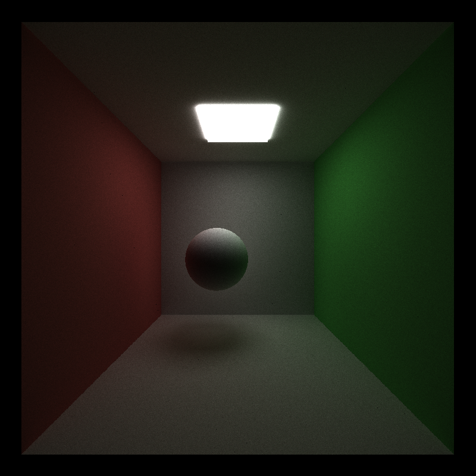
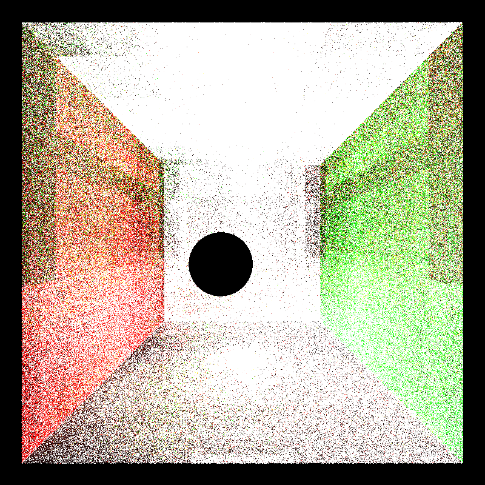
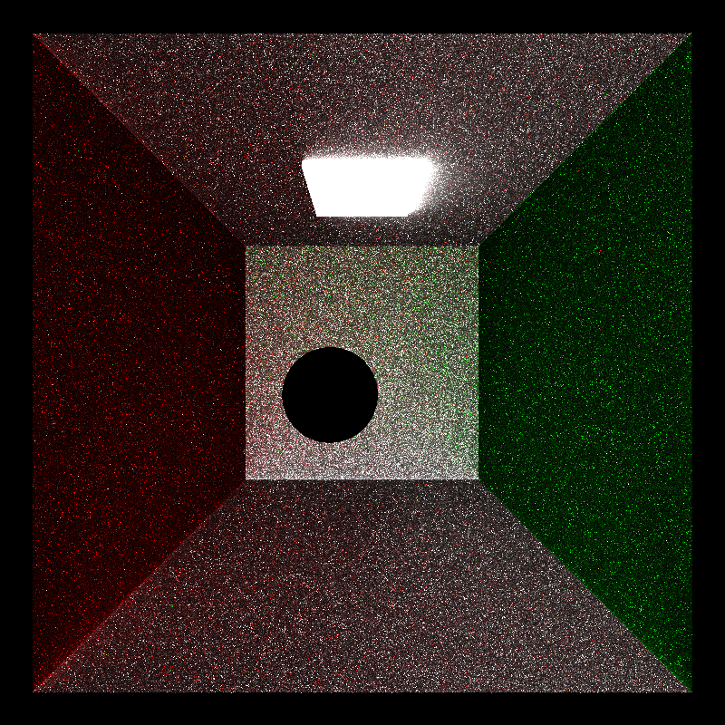

> Journal Entry - 2024-09-19
### *Diffuse Core Feature: "The real diffuse were the friends we made along the way"*

#### To Do

* ~~Implement Diffuse BSDF~~
* Implement perfect specular BSDF
* Implement terminating paths using stream compaction
* Make path segments contiguous in memory by material type
* implement stochastic sampled antialiasing: https://paulbourke.net/miscellaneous/raytracing/

#### Summary

Implemented the diffuse shading part of the `shadeMaterial` kernel. Was quite a debugging journey today trying to figure that out!

Note to self: the code I wrote for my GLSL path tracer from last year wasn't completely correct as I found out... so I'll be checking my work against the `PBRv5` book from now on!



#### Logs

###### Thu Sep 19 10:44:49 EDT 2024

Currently working on the diffuse bsdf part. Out of the core features this is the "hardest" part. 

Using my code from CIS 461 to help me with this. 

###### Thu Sep 19 11:07:02 EDT 2024

Figured out that the trace depth of the scene (the maximum number of bounces) is specified by the scene json! Cool. 

###### Thu Sep 19 11:35:01 EDT 2024

#### Questions to TA: 
* In the iterative naive version of the path tracing code, we had these concepts: throughput and radiance. In our base code, the path segments only contain a color, which starts at vec3(1.). How do we adapt throughput and radiance to this? 

###### Thu Sep 19 13:45:51 EDT 2024

Below first implementation of the diffuse bsdf shading code. Have no idea what's working and what's not because the output is so blown out.

Could I be not accounting for floating point error / averaging over total number of iterations? 



###### Thu Sep 19 14:33:14 EDT 2024

Getting closer! I needed to change the seed of the RNG generator of each bounce. 

```c++
makeSeededRandomEngine(iter, idx, pathSegment.remainingBounces);
```

But the illumination still looks weird...



###### Thu Sep 19 17:46:07 EDT 2024

We got there in the end!!!

First, I fixed a bug in my world-to-local coordinates code that was making the `wi` weird: 


Okay... still not great. Found out I was using the `wo` vector to calculate my lambertian absdot function, so I fixed that:


Much better! But the corners of the box looked way to bright for some reason... and I couldn't really put my finger on it. I had some idea that it was probably the way I was calculating my `pdf`? 

So I was looking through the Physically Based Rendering book and pretty found out I was missing something: 

```c++
// From https://pbr-book.org/4ed/Reflection_Models/Diffuse_Reflection, 
// to be honest I'm not sure what this does yet.
// I guess, if we're intersecting with a point that's 
// "upside down", we have to flip our generated iw too?
if (local_wo.z < 0) wi.z *= -1;

// get the pdf (square to hemisphere cosine)
pdf = glm::abs(wi.z) * INV_PI;
```
So apparently, if you find that the z value of your `wo` is less than zero, you should flip your `wi` and calculate the `pdf` function. I'm not really sure why. I should probably give the book more of a read to find out! 

Anyway, that totally fixed my problem, hooray!: 


