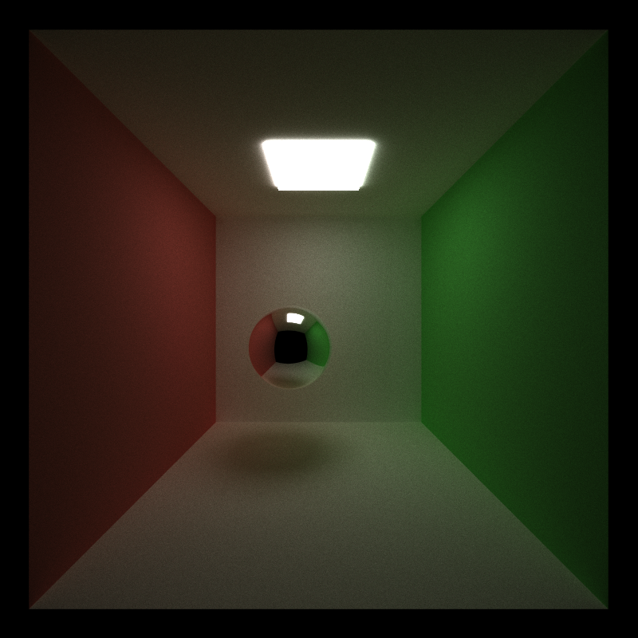
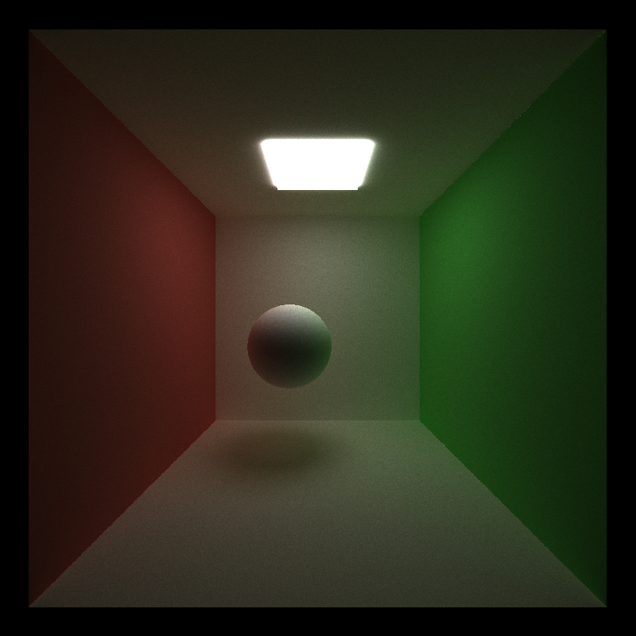

> Journal Entry - 2024-09-20
### *Perfect specular and stream compaction*

#### To Do

* ~~Implement Diffuse BSDF~~
* ~~Implement perfect specular BSDF~~
* ~~Implement terminating paths using stream compaction~~
* ~~Make path segments contiguous in memory by material type~~
    + ~~But it made things slower. Was that supposed to happen???~~ 
* ~~implement stochastic sampled antialiasing: https://paulbourke.net/miscellaneous/raytracing/~~

### Summary

Looks good! All core features implemented! Except for the contiguous path segments thing!! that is way slower!

Also! I may need to refactor my code to use the `scatterRay` function! and also deal with layered(?) materials! How does that work! idk! 

###### Fri Sep 20 11:17:25 EDT 2024

Gonna try with implementing perfect specular. Shouldn't be too hard? 

###### Fri Sep 20 13:59:18 EDT 2024

Okay, I went back to my diffuse implementation because something is off alwkejflwaijef

    
    

