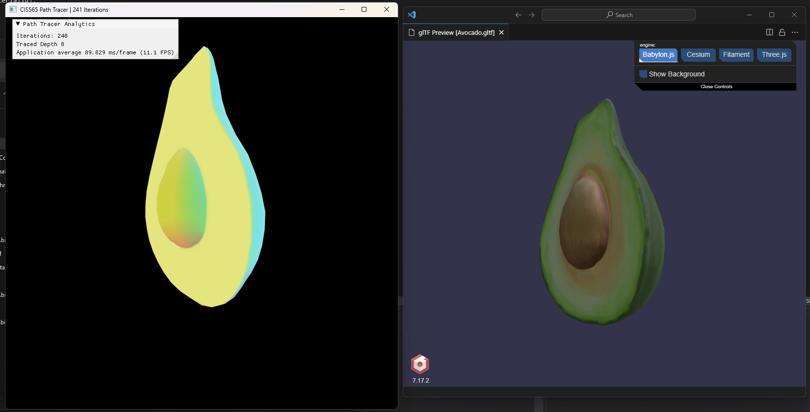
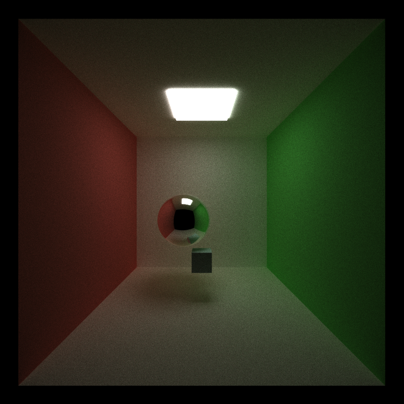
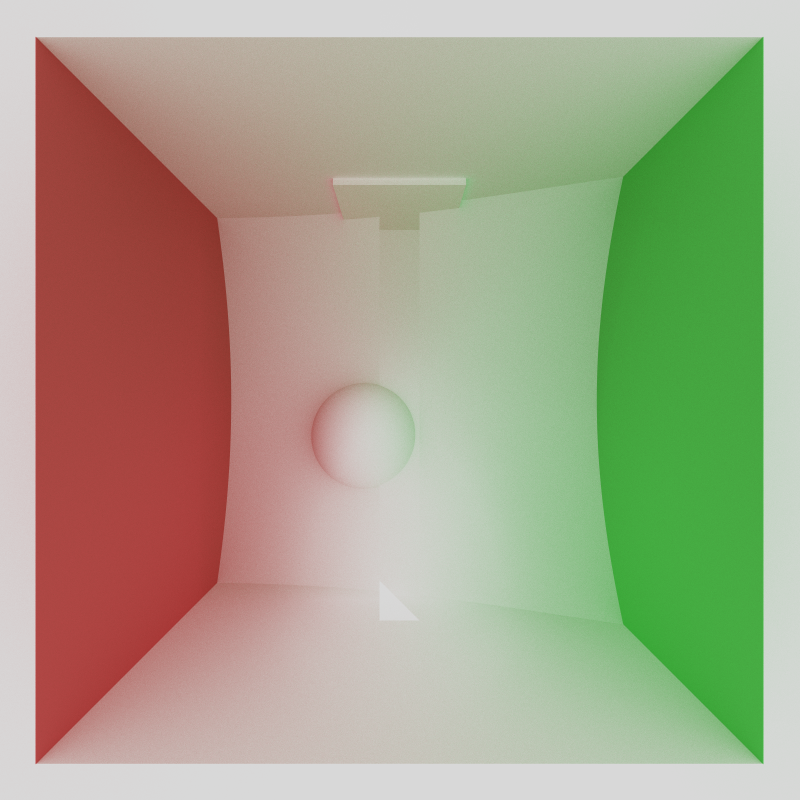
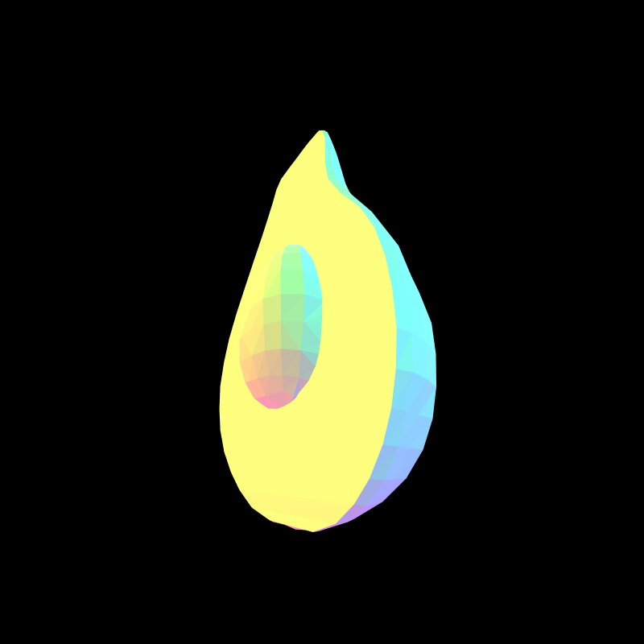
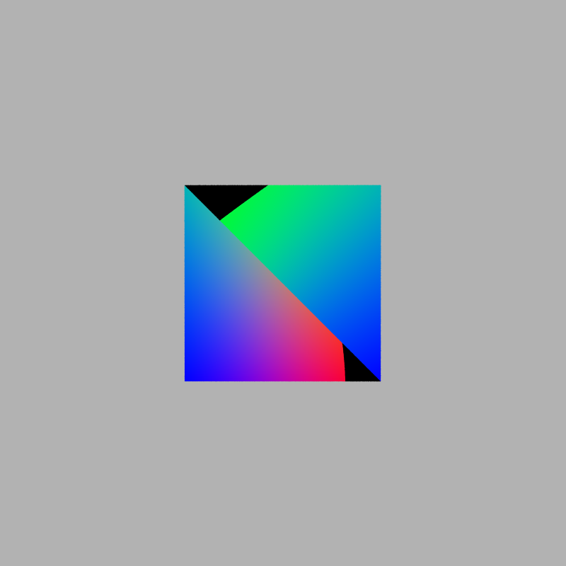
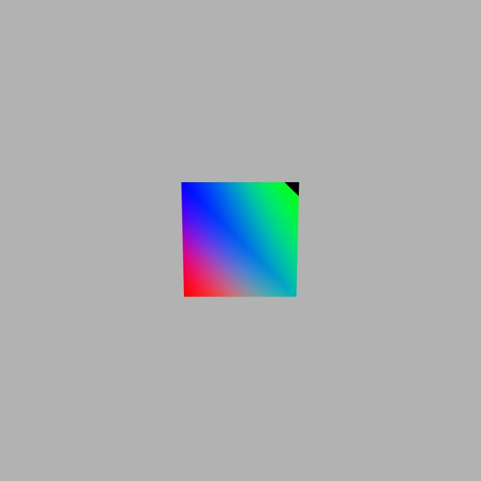

> Journal Entry - 2024-09-25
### *That's a Smooth Avocado* 🙂🥑

#### TO DO: 

* gltf loading
    * ✔️ be able to fill vertex position and normal buffers
    * ✔️ implement ray-triangle intersection
    * ✔️ surface normals are based on imported vertex normals
    * json scene can take gltf files
* Texture mapping
    * texture mapping
    * bump mapping
* Specular BSDF
* Physically-based depth-of-field
* Bounding box test / BVH
> * Open-Image Denoiser (?)

> (?) means "nice to have / optional"

###### Wed Sep 25 14:25:56 EDT 2024

Update to my journal! I have implemented gltf loading with vertex normals :D

Below are a bunch of pics of it working. In the next section I have included WIP pics and bloopers!

###### Render with a glTF cube

###### Wed Sep 25 15:42:01 EDT 2024

Currently working through texture mapping by looking at ScratchaPixel: https://www.scratchapixel.com/lessons/3d-basic-rendering/introduction-to-texturing/introduction-to-texturing-basic-implementation.html 

###### Wed Sep 25 23:46:02 EDT 2024

Turns out the actual texture mapping technique was not that hard lol. But actually getting textures on to the GPU through CUDA is actually kind of tough? 

### glTF Loading Bloopers

###### Wasn't using glm::rayIntersectTriangle correctly...

###### Avacado render with no normals (instead, normals based on face orientation)

###### I was indexing my vertex normals incorrectly...

###### Fixed!

