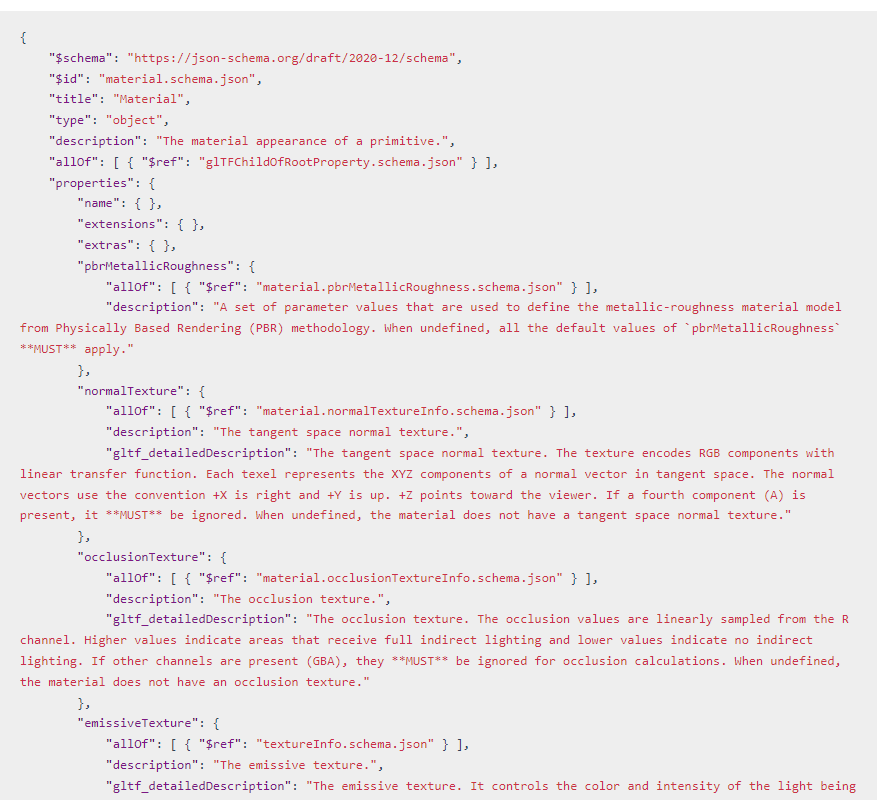

> Journal Entry - 2024-09-26
### **

#### TO DO: 

* gltf loading
    * ✔️ be able to fill vertex position and normal buffers
    * ✔️ implement ray-triangle intersection
    * ✔️ surface normals are based on imported vertex normals
    * json scene can take gltf files
* Texture mapping
    * ✔️ implement cuda object texture API
    * ✔️ texture mapping
    * bump mapping
* Specular BSDF
* Physically-based depth-of-field
* Bounding box test / BVH
> * Open-Image Denoiser (?)

> (?) means "nice to have / optional"

###### Thu Sep 26 20:32:51 EDT 2024

Implemented textures finally! Here are my results: 

###### Thu Sep 26 21:35:52 EDT 2024

Looking at how to parse a normal texture from a glTF (if there is one)

