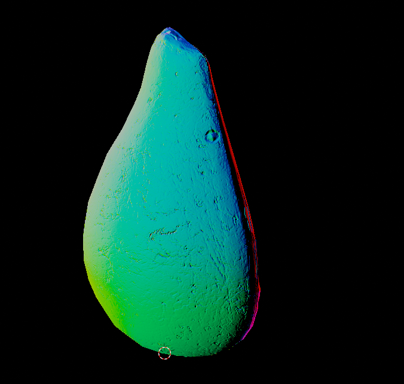

> Journal Entry - 2024-09-27
### *Bumpy Avo*

#### TO DO: 

* gltf loading
    * ✔️ be able to fill vertex position and normal buffers
    * ✔️ implement ray-triangle intersection
    * ✔️ surface normals are based on imported vertex normals
    * json scene can take gltf files
* Texture mapping
    * ✔️ implement cuda object texture API
    * ✔️ texture mapping
    * bump mapping
* Specular BSDF
* Physically-based depth-of-field
* Bounding box test / BVH
> * Open-Image Denoiser (?)

> (?) means "nice to have / optional"

###### Fri Sep 27 14:33:51 EDT 2024

Currently impementing bump mapping. I loaded the gltf into blender so I could at least visualize what the surface normals should look like after implementing it?

